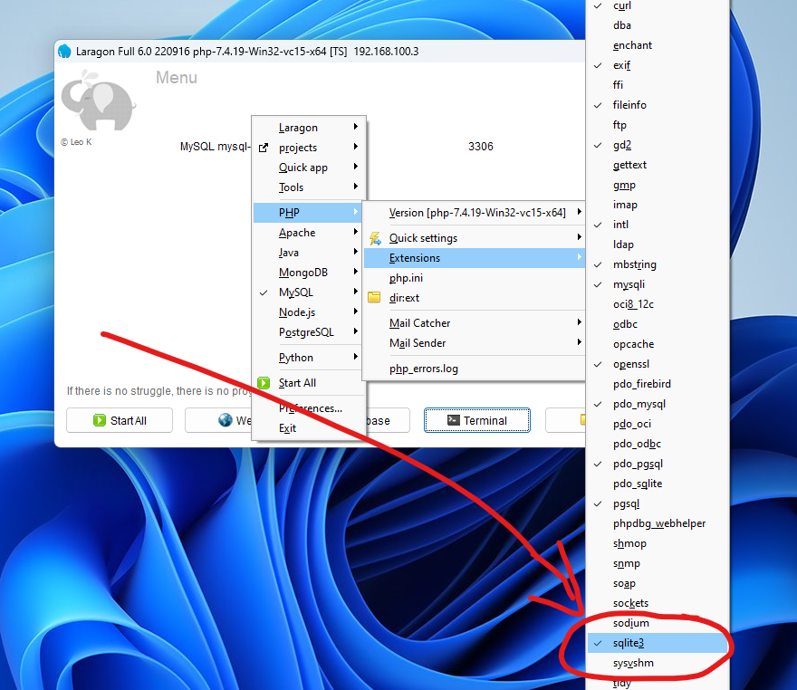

***PROJECT INI TIDAK DIIZINKAN UNTUK DIPERJUAL BELIKAN KEPADA SIAPAPUN KECUALI SUDAH ANDA MODIFIKASI***

<div align="center">
  <br>
  <b>🚀Sistem Informasi🚀</b>
  <h1>⚽ Booking Lapangan Futsal ⚽</h1>
  <br>
</div>

<p align="center">
  
  
  <a href="https://github.com/muhazmi/futsal/issues">
    
  </a>
  <a href="https://github.com/muhazmi/futsal/releases">
    
  </a>
</p>


Project ini dibuat dengan tujuan membantu Anda yang sedang belajar Codeigniter 3 dengan studi kasus pembuatan sistem booking lapangan futsal. Setelah belajar dan memahami project ini Anda dapat membuat project lain atau mengembangkan yang sudah ada supaya lebih baik lagi. Semoga bermanfaat.

## Fitur

1. Booking lapangan secara online
2. Nominal Omset Harian, Bulanan, dan Tahunan
3. Grafik/Statistik Omset Bulanan dalam 1 Tahun berjalan
4. Total data pada modul album, foto, event, lapangan, kategori, kontak, slider dan customer
5. Manajemen Transaksi (generate invoice berdasarkan tahun-bulan-tanggal yang akan reset setiap bulan secara otomatis)
6. Manajemen Lapangan
7. Manajemen Album dan Foto
8. Manajemen Event
9. Manajemen Kategori
10. Manajemen Slider
11. Manajemen Kontak
12. Manajemen User dan Customer
13. Profil Bisnis
14. Set Nominal Diskon Member

## Requirement

1. PHP 7.2^
2. SQLite3 (untuk testing) atau MySQL

## Library

1. IonAuth 2
2. Codeigniter 3 (3.1.8)
3. Bootstrap 3
4. AdminLTE 2

## Instalasi

### Paling Cepat

Pastikan Anda sudah install SQLite3 di pc/komputer/laptop Anda. Jika belum, silahkan install terlebih dahulu, lalu aktifkan extension sqlite3 di `php.ini` Anda

Jika anda menggunakan Laragon, silahkan aktifkan di menu PHP > Extensions > sqlite3 seperti gambar dibawah ini:



Kemudian pergi ke direktori project `root`, buka terminal lalu jalankan web server dengan perintah:

```bash
php -S localhost:8080
```

akses ke `http://localhost:8080` di browser Anda.

### Menggunakan Stack Development Server

> Karena bawaan database ini menggunakan SQLite3, perlu dilakukan penyesuaian pada file `application/config/database.php`. Silahkan baca instruksi comment pada file tersebut.

Saya asumsikan Anda telah menginstall lampp stack, xampp, atau local development server lainnya. Kalau sudah, silahkan lanjut ke tahapan dibawah ini, namun apabila belum maka bisa ke bagian paling bawah yang ada di README ini.

1. Silahkan download/clone project ini ke pc/komputer/laptop Anda
2. Letakkan di folder htdocs
3. Buat database baru di phpmyadmin atau database manager lainnya dengan nama futsal
4. Import database yang ada di dalam folder db
5. Buka terminal ke direktori project dan jalankan perintah composer update
6. Akses ke `http://localhost/futsal`

## Cara Login

1. Backend: Sebagai SuperAdmin atau Admin:
    - Akses ke `/admin/auth/login`
    - Gunakan akun SuperAdmin dengan email superadmin@gmail.com dan password: superadmin, Admin: administrator@gmail.com dan password: administrator
2. Frontend: Sebagai Customer Biasa dan Sudah Berlangganan Member
    - Akses ke `/futsal/auth/login`
    - Gunakan akun biasa dengan email `batistuta@gmail.com` dan password: asdfghjkl, Admin: `userpremium@gmail.com` dan password: asdfghjkl

## Catatan

1. Created by Muhammad Azmi - [muhazmi.my.id](https://muhazmi.my.id) / AmperaKoding - [amperakoding.com](https://amperakoding.com)
2. Sistem membership dilakukan secara manual dengan cara Customer menghubungi SuperAdmin. Kemudian SuperAdmin akan mengganti Tipe User Customer tersebut di backend panel sebagai SuperAdmin.

## Cara Install Local Development Server

Anda bisa menginstall xampp/wampp atau LAMPP Stack di pc/komputer/laptop yang dipakai. Tutorialnya bisa Anda ikuti disini:

1. [Cara Install Apache, MySQL, dan PHP di OS Linux (LAMPP)](https://amperakoding.com/article/cara-install-apache-mysql-dan-php-di-os-linux-lampp)
2. [Cara Install Xampp di OS Linux](https://www.muhazmi.com/2016/12/cara-install-xampp-yang-baik-dan-benar.html)
3. [Cara Install Xampp di OS Windows](https://www.muhazmi.com/2017/08/cara-install-xampp-yang-baik-dan-benar.html)

Referensi lainnya terkait SQLite3:

1. [Dari Nol: Pengalaman Menggunakan SQLite dan PHP di Laragon](https://rachmad.dev/blog/dari-nol-pengalaman-menggunakan-sqlite-dan-php-di-laragon)
